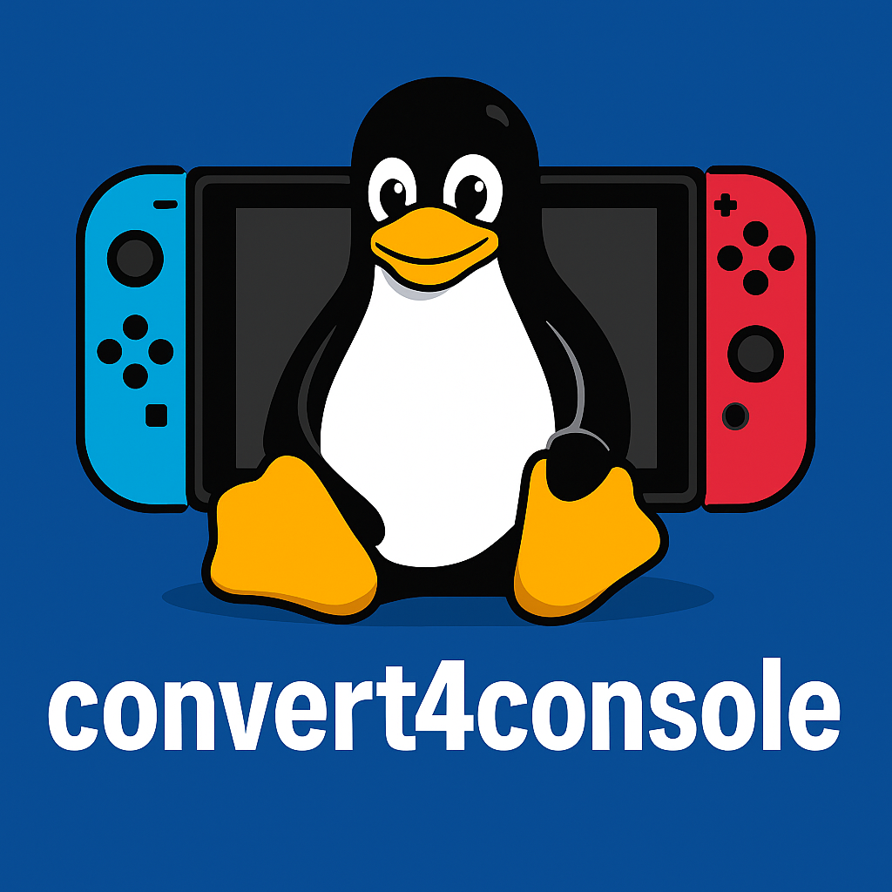

## Convert4Console v1.0 – One Script to Rule Them All
**Convert. Play. Enjoy.**

Welcome to the first public release of **convert4console** — the easiest way for anyone, regardless of Linux experience, to convert and optimize videos for smooth playback on their favorite gaming consoles. Whether you're a gamer who loves to binge on the big screen or someone who just wants their favorite shows on the go — this script is for you.

---

### What it does:
This lightweight yet powerful Bash script automatically scans, analyzes, and converts your videos for optimized playback on:

- **PS Vita**  
- **PS3**  
- **PS4**  
- **PS5**  
- **Xbox One / Series X / Series S**  
- **Nintendo Switch** (via **L4T Ubuntu** + **NXMP** or **PPlay**)

---

### Key Features:
- Clean and colorful console interface (no Linux knowledge required!)  
- Auto-detects video formats, resolutions, and compatibility  
- Gives you full control: Convert all or only selected videos  
- Preserve or customize metadata (add your own title, author, description)  
- Supports nearly every video format you throw at it  
- Auto-renames or skips existing files, avoiding accidental overwrites  
- Keeps track of what you've already converted  
- Output videos are sorted into organized folders, mirroring your original structure  
- Works great with **Switch L4T Ubuntu** to watch your collection via **NXMP** or **PPlay**  
- **Automatically checks for missing or outdated dependencies** and installs/updates them  
- **Built-in update checker** – detects new versions and helps you stay current

---

### Why You’ll Love It:
Whether you're a casual movie lover or a power user, convert4console is built to be **fun**, **simple**, and **universal**. It’s fast. It’s smart. And it’s perfect for **both boys and girls** who just want stuff to work.

---

### What’s Coming in Future Versions:
- Animated progress bars  
- Even more colorful status tables  
- Support for additional output presets  
- USB mass storage auto-detection with output redirection  
- Subtitle embedding support (.srt and .txt formats)  
- Backup / restore converted history  
- Smarter update system  
- Dependency self-healing improvements  

And possibly...

- A **Switch Homebrew App** version  
- A **PS Vita VPK**  
- A **PS3/PS4 PKG** version for native console playback  
- A **GUI version** for Windows/Linux

---

### Join the Movement.  
**Movie night just got upgraded — console-style.**

---

**Got ideas, improvements, or just love what I'm building?**  
**Contact me:**  
- Email / Google Chat: kvaughan2891@gmail.com  
- Discord: [Gaming_Fool2891]  
- Reddit: [u/Gaming_Fool2891]  
- Telegram: [https://t.me/Nintendo_Brew_Chat](https://t.me/Nintendo_Brew_Chat) / [https://t.me/GamingFool2891](https://t.me/GamingFool2891)

**Collaboration is welcome. Theft isn't.**
